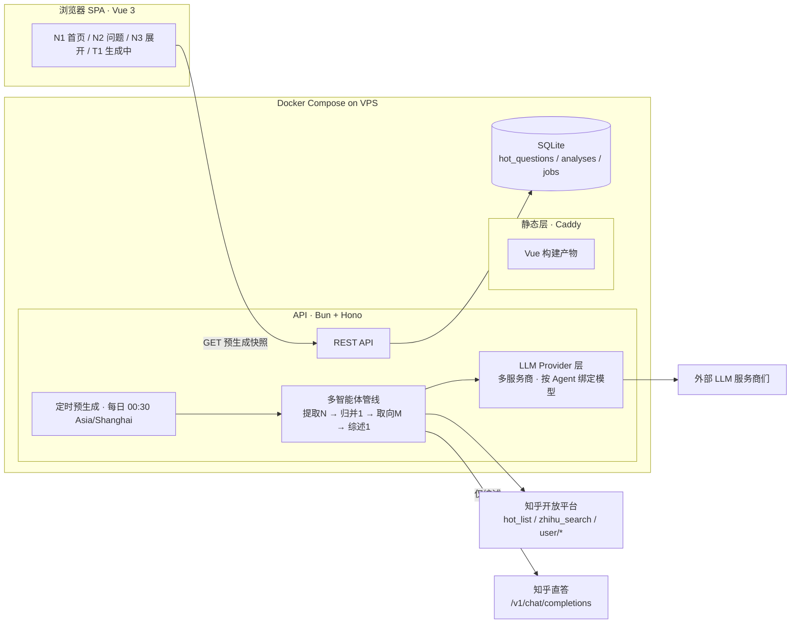
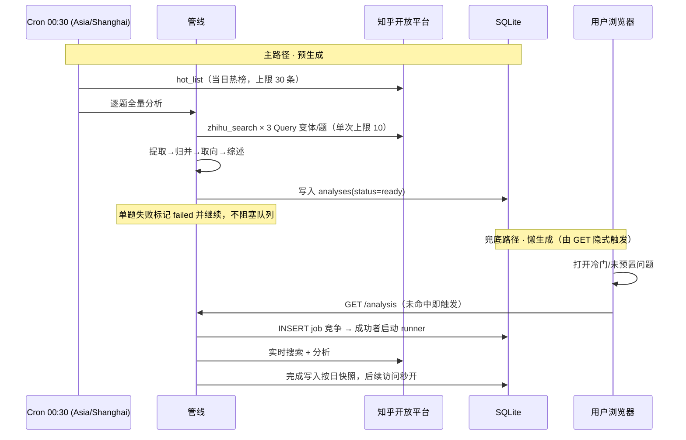

# 两面 · 开发总览

> 知乎黑客松 2026 ·「两面」技术文档 1/3
> 依据：产品说明 v5（2026-08-29）+ Ardot 设计稿（fileId 720073658226461）+ 知乎 Skill `0.5.3-beta.20260904115023`
> 本文档回答「系统长什么样、为什么这么定」；细节分别在 [前端文档](./02-前端开发文档.md)、[后端文档](./03-后端开发文档.md)、[环境变量与密钥清单](./04-环境变量与密钥清单.md)。

---

## 1. 项目一句话

输入一个知乎问题，把社区回答提炼成十几条判断，每条判断展开成一条**取向光谱**：两端由判断自身内容定义，每档站着真实答主（昵称 + 认证 + 权威级 + 可回跳原文的原话）。产品不评判对错，只呈现分布。

**两条硬约束贯穿全部开发**：

1. **预置热榜问题打开即出结果** —— 预置题的渲染路径零实时**生成**调用，全部读按日分析快照；冷门/未预置问题允许进入懒生成路径（进 T1 生成态），快照落地后同样秒开
2. **一切可回溯** —— 每条判断绑定原话引用，每个归位绑定理由，全部可点回知乎

## 2. 技术选型（已拍板）

| 层 | 选型 | 决策理由 |
|---|---|---|
| 前端 | **Vue 3 + Vite + TypeScript** + Pinia + vue-router | 开发者最熟，出活最快 |
| 视觉渲染 | **CSS + Canvas 混合** | 光幕/钉子/卡片走 CSS+DOM（还原设计稿最易）；迷你光谱带走 Canvas（圆点命中检测、DPR 精确绘制） |
| 后端 | **Bun + Hono（TypeScript）** | 轻快；LLM 调用统一走 OpenAI 兼容原生 fetch，不绑重 SDK，留 Node 回退路径 |
| 编排 | **自写轻量并发编排**（Promise 池 + 信号量 + 任务状态表） | 无框架依赖，评委和队友都看得懂；LangGraph/队列对此项目是过度设计 |
| LLM | **多服务商配置层**，每个 Agent 独立绑定 `provider/model`；直答单独封装 | 不押注单一供应商；知乎直答仅用于综述，永不挪用 |
| 存储 | **SQLite**（bun:sqlite） | 按日分析快照键 `{东八区日期}:{qid}` 天然主键，单文件零运维 |
| 部署 | **自有 VPS + Docker Compose** | 前端静态 + API + 定时任务一个 compose 拉起，完全可控；TLS/对外反代由你自行部署 |
| 文档 | Markdown（本目录）+ Mermaid | git 友好，随代码演进 |

## 3. 系统架构



## 4. 核心数据流

### 4.1 两条生成路径（缺一不可）



**时区铁律**：所有日期计算显式 `Asia/Shanghai`，不依赖运行环境时区。快照当日有效，东八区次日 00:00 失效。

**失败闭环**：单题失败 → 快照置 `failed`（**终态，不自动重试**，避免额度黑洞）→ 前端停止轮询并给出重试入口 → 次日 cron 用新日期键自然重建；`failed` 题不进 hot 列表，不影响其余题目。完整状态机见后端文档 §6。

### 4.2 数据管线（扇出—扇入）

| 阶段 | 并发 | 职责 | 输出 |
|---|---|---|---|
| 01 提取 | N 路（批量化：一次 3–5 条回答） | 从单条回答抽**可争议判断句** + 原话定位 | 判断句 + 引用 |
| 02 归并 | 1 路串行 | 语义聚类去重，合并同议题表述 | 去重判断列表 |
| 03 取向 | M 路（每判断 1 个） | 推导两端定义 + 每答主归档 + **归位理由** | 光谱分布 |
| 04 综述 | 1 路 | 知乎直答生成中立综述；额度耗尽降级外部 LLM | 看山解读 |

硬约束（详见后端文档 §4）：只抽可争议判断、无引用即丢弃、归位无理由不采纳。

### 4.3 设计稿 → 数据契约对照

| 设计稿元素 | 数据字段 |
|---|---|
| N1 热榜弹幕道（24 条） | `GET /hot` → 预生成 30 条（只含 ready），前端裁剪 |
| N2 钉子「N 人表态 · 分歧度X」 | `judgment.participantCount` / `judgment.divergence` |
| N2「还有 9 条」 | 首屏 4 条 + 折叠，接口一次给全，前端控制显隐 |
| N3 光谱两端文字 | `judgment.semanticAxis.left / right`（判断自有语义轴，slot 不跨判断比较） |
| N3 光谱圆点（答主） | `distribution[slot].authors[]`（昵称+认证+权威级+原话+链接） |
| N3「已选中 · L4」标签 | 选中答主的 `authority`（源字段是 String，入库转 number） |
| N3 看山解读 | `judgment.summary` + `summarySource`（直答或降级产物，前端按来源双态展示） |
| N3 引用卡「查看知乎原文」 | `author.url`（接口自带溯源 UTM，原样透传，不改写） |
| T1 四阶段进度 | `GET /analysis` 的 202 响应：`status` + `stage`（01–04）+ `stageRatio` |
| 诚实声明行 | `analysis.sampleCount`（实际 N 条回答，不谎称全部） |

**计数口径**：`sampleCount` = 回答**条数**，`participantCount` = 答主**人数**——两个维度，禁止互换。完整规则见后端文档 §5.2。

## 5. 仓库结构

```
two-sides/
├── apps/
│   ├── web/                # Vue 3 + Vite + TS（前端文档）
│   └── server/             # Bun + Hono + TS（后端文档）
├── packages/
│   └── contract/           # 共享类型 + zod schema（API 契约唯一事实源）
├── config/
│   └── providers.yaml      # LLM 服务商与 Agent 绑定配置（只写 env 变量名）
├── docker-compose.yml
└── docs/
    ├── 01-开发总览.md
    ├── 02-前端开发文档.md
    ├── 03-后端开发文档.md
    └── 04-环境变量与密钥清单.md
```

**契约先行**：`packages/contract` 里的 TypeScript 类型 + zod schema 是前后端唯一接口事实源。前端开发期用 mock fixture 跑全链路（`VITE_API_MODE=mock`），不等后端；后端按同一份类型实现，联调即换 baseURL。

## 6. 凭证与配置

**三样东西不要混**：开放平台的 **Access Secret** 鉴权"调用方"；黑客松活动页发的 **App ID / App Key** 用于 OAuth；用户授权后的 **access token** 代表该用户。App Key 不能当 Access Secret 用。

| 凭证 | 必填 | 申请入口 |
|---|---|---|
| `ZHIHU_ACCESS_SECRET` | ✅ | <https://developer.zhihu.com/profile> → 申请新 Access Secret |
| `ZHIHU_OAUTH_APP_ID` / `APP_KEY` / `REDIRECT_URI` | 增强层 | 活动页创建项目后分配（未获批则整层不启用） |
| 外部 LLM key（`DEEPSEEK_API_KEY` 等） | ✅ | 各服务商控制台，按 `providers.yaml` 的 `apiKeyEnv` 注入 |

完整清单、安全边界与 `.env.example` 见 [04-环境变量与密钥清单](./04-环境变量与密钥清单.md)。

## 7. 赛程与里程碑（绝对日期）

| 节点 | 时间 |
|---|---|
| 报名与组队截止 | 2026-09-13 00:00 |
| 作品提交窗口 | 2026-09-13 10:00 – 09-15 10:00 |
| **最终截止** | **2026-09-15 10:00，不补交** |

按今天（09-11）倒排：

| 时间 | 目标 |
|---|---|
| **09-11 晚 – 09-12** | D0 契约冻结（含 `ProgressResp` 与失败码）→ 前后端骨架 + mock 全通 → 首页/问题页静态还原 |
| **09-12** | D1 Provider 层 + 管线四阶段 + 懒生成 + 单端点轮询 → T1 与失败态联调 |
| **09-13 上午** | D2 cron 预生成 + Compose 上线 → 秒开验收（10:00 提交窗口一开即可提交） |
| **09-13 – 09-14** | D3 产品说明 + 仓库整理 + 演示视频录制 |
| **09-14 – 09-15 10:00** | D4 提交前检查、打磨、最终提交（留一整个缓冲日） |

增强层（OAuth）只在 D4 之前还有余力时做；没批下来就砍掉，时间回填打磨。

## 8. 风险与待验证项

1. Query 变体去重后实际收益（15–25 条是否成立）——`Count` 单次上限 10，方案成立，实测为准
2. `ContentText` 长回答是否截断
3. `AuthorityLevel` 在热榜问题中的分布（决定「权威分布」是否有内容）
4. 光谱五档粒度是否挤中间档
5. 两端定义的表述自然度
6. 并发管线实际加速比与失败率
7. **直答额度**：100/日是最紧的一环，30 题预生成就用掉 30；评审期务必提前提额
8. **OAuth 审批时效**：未获批则增强层降级

外部 LLM 日均约 1,260 次调用（30 题预生成），靠批量化（1/3）+ 按日快照复用 + 小模型压成本。

## 9. 赛事交付与合规

**交付物**

| 项 | 要求 |
|---|---|
| 可运行体验链接（**必交**） | 公网可访问、评委可实际上手 |
| 产品说明介绍（**必交**） | 初审重点：核心创作思路、用户如何完成核心体验、整体技术方案、用了哪些知乎开放能力、与社区生态的契合点、对社区用户的价值 |
| 代码仓库（选交加分） | GitHub / Gitee，展示代码结构与工程规范 |
| 演示视频（选交加分） | 公开视频链接，完整展示核心功能与使用场景 |
| 项目 icon 与封面图 | 创建项目时必填（素材来源见前端文档 §10） |

**提交前检查**（逐条对照）

1. Demo 能从公网打开并跑完核心流程
2. 项目名称、介绍、赛道、封面、产品说明已完成
3. 仓库与视频链接评委可访问
4. 使用 OAuth 时，回调地址与活动页登记值完全一致（含尾部斜杠）
5. **凭证没有出现在代码仓库、前端响应、日志、截图或视频中**
6. 接口失败、额度耗尽、空数据都有真实降级提示（不是白屏）
7. 页面、接口、登录流程经过实际运行验证——不把"代码写完了"说成"线上可用"

**能力使用与缓存**：赛事要求「调用有额度限制的开放能力时应做应用层缓存与请求去重」，也禁止批量高频无意义调用。我们的按日快照 + 题内去重正好满足；不用全网搜索（会丢知乎专属信号），不用刷屏式调用。

**素材与 IP（待你确认）**：官方素材包位于参赛流程文档的「官方 API 说明及黑客松 skill & 素材下载」章节（需登录查看，我未能读取正文）。在拿到素材与授权说明前：

- N3「看山解读」的图标使用**中性占位图形**，不自行绘制或改绘官方形象
- 项目 icon / 封面用产品自有视觉（光幕与光谱）生成，不依赖未确认素材
- 待确认项：①素材包含哪些文件 ②是否允许改色/裁切 ③署名与标注要求 ④能否用于项目 icon 与封面
