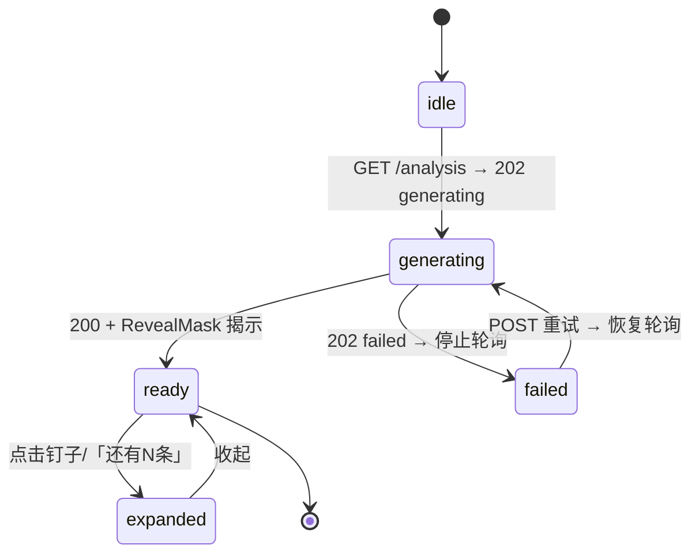

# 两面 · 前端开发文档

> 技术文档 2/3 · Vue 3 + Vite + TypeScript · CSS + Canvas 混合渲染
> 所有视觉参数均从 Ardot 设计稿实测（1440×900 基准），非估算。
> 密钥与环境变量见 [04-环境变量与密钥清单](./04-环境变量与密钥清单.md)。

---

## 1. 技术栈与依赖

| 项 | 选型 | 说明 |
|---|---|---|
| 框架 | Vue 3.5 + `<script setup>` + TS | |
| 构建 | Vite 5 | |
| 路由 | vue-router 4 | 两个路由，见 §2 |
| 状态 | Pinia | 一个 store 足够 |
| UI 库 | **无** | 全部手写组件，设计稿还原优先 |
| 字体 | Noto Serif SC / Inter / Sarasa Gothic SC | 自托管 woff2 子集化，不依赖外链字体（评委网络不可控） |
| Mock | `VITE_API_MODE=mock` + 本地 fixture | 开发期不等后端 |

## 2. 路由与页面状态机

```
/           → N1 首页
/q/:qid     → 问题页（一个端点决定一切）:
                GET /questions/:qid/analysis
                ├─ 200                    → N2 钉子列表（快照就绪，秒开）
                ├─ 202 generating/pending → T1 生成中（管线进度 + 揭示遮罩）
                ├─ 202 failed             → 失败卡片（含重试入口）
                └─ 展开某条钉子            → N3（同路由内状态，不换路由）
```

**快照决定入口状态**：预置热榜题直接 200 秒开；冷门/未预置题由 GET 隐式触发懒生成（后端抢到 job 所有权即开工），返回 202 进 T1——「零实时生成调用」承诺的是**预置题的渲染路径**。轮询的就是这个 GET 本身，**没有第二个端点**。

**N3 不是独立路由**：选中判断后光幕高度 600→300 过渡、详情区从下方 reveal，对应设计稿的光幕下移动画。刷新时通过 URL query `?j=<judgmentId>` 恢复展开态。



## 3. 设计 Token（实测值）

### 3.1 颜色

```css
:root {
  --ink:        #1C1B19;  /* 主文字 / CTA 底 · 设计稿 0.110,0.106,0.098 */
  --ink-deep:   #0D0D0F;  /* 钉子胶囊/竖线、光谱圆点 · 0.051,0.051,0.059 */
  --ink-soft:   #23231C;  /* PinMeta 数字 · 0.137,0.137,0.110 */
  --muted:      #8B877C;  /* 次级文字 / 声明行 · 0.545,0.529,0.486 */
  --faint:      #B8B2A6;  /* T1 等待态阶段文字 · 0.722,0.698,0.651 */
  --line:       #E2DFD8;  /* 输入框/引用卡描边 · 0.886,0.875,0.847 */
  --card-line:  rgba(28,28,25,.10);   /* 热榜卡描边 */
  --card-glass: rgba(255,255,255,.90); /* 热榜卡底 */
  --quote-bg:   #F7F6F3;  /* 引用卡底 */
  --tag-bg:     #F2F0EA;  /* 「已选中 · L4」标签底 */
  --end-l:      #5FA2C0;  /* 光谱左端文字（蓝） */
  --end-r:      #D5A475;  /* 光谱右端文字（琥珀） */
}
```

**光谱五档渐变**（MiniBand，linear 90deg）：

| 档位 | 位置 | 色值 |
|---|---|---|
| 1 左端 | 0% | `#2E80A8` |
| 2 | 25% | `#5EA3BF` |
| 3 中立 | 50% | `#C7C2B0` |
| 4 | 75% | `#D6A475` |
| 5 右端 | 100% | `#BA8A42` |

### 3.2 字体与字号

| 用途 | 字体 | 字号/行高 |
|---|---|---|
| 品牌 Wordmark | Noto Serif SC Bold | 26 |
| 首页副标题 | Inter Regular | 13 |
| 问题标题（N2/N3） | Noto Serif SC Bold | 34 / 48px 行高 |
| 钉子判断文本 | Noto Serif SC Medium | 17 / 27px 行高 |
| 钉子元信息「12 人表态 · 分歧度高」 | Inter Medium | 12 |
| 展开标题 | Noto Serif SC SemiBold | 20 / 30px |
| 两端定义文字 | Noto Serif SC Medium | 12 |
| 看山解读正文 | Sarasa Gothic SC Regular | 13 / 22px |
| 引用正文 | Noto Serif SC Regular | 14 / 24px |
| 声明行 / 链接 | Inter Regular / Medium | 12 |
| T1 阶段标签 | Noto Serif SC Medium | 14（编号 Inter Medium 11） |

### 3.3 布局基准（1440×900）

| 区域 | 几何 |
|---|---|
| 页边距 | 48px |
| N1：品牌行 y0 h100 · 光幕区 y100 h600 · 输入行 y700 h100 · 声明行 y800 h100 | |
| 热榜卡 | 宽 300 · 圆角 10 · 内边距 20 · 卡间距 28 · 三条弹幕道 y=146/258/370 |
| N2/N3 问题头部 | 内边距 36（上下），标题下方间隔 20 |
| 钉子 Pin | 宽 300 · 间距 14 · 首个 x=48；PinStem 宽 12（胶囊头 11×22 + 竖线 2px），PinContent 上内边距 40、右内边距 14 |
| N3 详情区 | 光幕 h300，详情区内边距 32（上下）/48（左右），区块间距 14 |
| 输入框 | 高 52 · 圆角 26 · 内边距 18；CTA 高 52 · 圆角 26 · 内边距 28 |

## 4. 玻璃光幕实现（纯 CSS，五层结构）

设计稿组件 `C_VeilGlass / C_VeilGlass600` 实为五层叠加，CSS 一一对应：

```html
<div class="veil" :style="{ '--h': heightPx + 'px' }">
  <!-- 1 GradientBase：光谱底渐变，opacity .58 -->
  <!-- 2 CutMask：白色竖切遮罩（切出玻璃条） -->
  <!-- 3 GlossEdges：每条玻璃的白色高光边 -->
  <!-- 4 TopSheen：上沿反光（高 44/600→80/600 的白 34%→0 渐变） -->
  <!-- 5 FadeLayer：上下渐隐，融进白底 -->
</div>
```

**层 1 · 光谱底**（17 个 stop，从实测取关键 9 个，两端全饱和、中间消饱和）：

```css
.veil__base {
  position: absolute; inset: 0; opacity: .58;
  background: linear-gradient(90deg,
    #3C6B8A 0%, #5B7A8D 12.5%, #7A8A90 25%, #979D9A 37.5%,
    #B4B0A5 50%, #B8A585 62.5%, #BC9A67 75%, #B08750 87.5%, #A57439 100%);
}
```

**层 2+3 · 竖切与高光**：用一层 `repeating-linear-gradient` 白色竖条遮罩同时完成「切」与「留边高光」，**条数随容器宽度自适应**（设计要求：条数随屏宽变化）：

```css
.veil__cut {
  position: absolute; inset: 0;
  --strip: 118px; --gap: 6px;  /* 条宽自适应：min(strip, 12vw) */
  background: repeating-linear-gradient(90deg,
    transparent 0, transparent calc(var(--strip) - 2px),
    rgba(255,255,255,.92) calc(var(--strip) - 2px), rgba(255,255,255,.92) var(--strip));
}
```

**层 4+5 · 反光与渐隐**：两个伪元素：

```css
.veil::before { /* TopSheen */
  content:""; position:absolute; top:0; left:0; right:0; height:13%;
  background: linear-gradient(180deg, rgba(255,255,255,.34), transparent);
}
.veil::after { /* FadeLayer */
  content:""; position:absolute; inset:0;
  background: linear-gradient(180deg, #FFF 0%, transparent 34%, transparent 66%, #FFF 100%);
}
```

`600px`（首页/N2）与 `300px`（N3 下移态）共用同一组件，仅高度不同；N2→N3 过渡用 `transition: height .5s cubic-bezier(.22,.61,.36,1)`。

## 5. Canvas 光谱带（MiniSpectrum）

CSS 负责不了圆点命中检测和 DPR 精确绘制，光谱带走 Canvas：

- **绘制**：底带 8px 圆角渐变（§3.1 五档色）+ 答主圆点（普通 10px / 选中 14px 白描边 2px，实测值）+ 空档不画点（诚实设计）
- **DPR**：`canvas.width = cssWidth * devicePixelRatio`，ctx.scale，保证 Retina 清晰
- **命中**：存每点 `(x, y, r)`，click 时逆推命中 → emit `select(author)`；hover 时 cursor: pointer + 轻微放大
- **数据驱动**：`slotCenter(i) = padding + (i + .5) * slotWidth`，五档等分；同档多人横向微散开（±6px 内，避免完全重叠）
- **计数一致性**：渲染前可用 `Σ authors.length === participantCount` 做 dev 断言，防止口径漂移（后端文档 §5.2）
- **组件**：`MiniSpectrum.vue`，props: `judgment`，emits: `select`；选中态由父级管理

## 6. 组件树

```
App
├── TopBar                    # 品牌行：Wordmark + Tagline / 问题页变为 BackLink + 标题
│   └── LoginBtn              # 「知乎授权登录」→ OAuth（条件模块）
├── N1 HomePage
│   ├── VeilGlass h600        # §4 光幕
│   ├── HotGrid               # 三条弹幕道 + ScrollHint + 底部进度条 + 方向图标
│   │   └── HotCard ×24       # 热榜问题卡（白90%玻璃卡）
│   ├── SearchBar             # InputBox（搜索icon + placeholder「想点什么？」）+ CTA「看看分歧」
│   └── HonestFooter          # 样本/偏差/立场 三段声明
├── QuestionPage (/q/:qid)
│   ├── QuestionHeader        # BackLink + 问题标题
│   ├── VeilGlass (h600 ⇄ h300)
│   ├── PinRail               # 首屏 4 钉 + MoreHint「还有 N 条」
│   │   └── Pin ×n            # PinStem(胶囊+竖线) + PinContent(文本+meta)
│   ├── T1Progress (v-if 202)         # 阶段条 01–04 + RevealMask
│   ├── FailedCard (v-if failed)      # 失败文案 + 重试按钮（retryable 时）
│   └── ExpandedPanel (v-if 展开态)
│       ├── ExpandedHead      # 展开标题 + SelectedTag「已选中 · Lx」
│       ├── MiniSpectrum      # §5 Canvas
│       ├── SpectrumCaption   # 「N 人表态 · 此处展示权威前 5 位 · 分歧度极高」＋独立一行「另有 N 条精选评论提出不同看法」（无评论不渲染）
│       ├── KSBlock           # 看山解读：KSMark(16，素材待定，见 §10) + 标题 + 来源徽标（summarySource 双态）+ 正文
│       └── QuoteCard         # 原话引用 + LinkIcon + 「查看知乎原文」(target=_blank)
```

**KSBlock 来源双态**（`summarySource` 驱动，必须一眼可辨——否则降级后用户仍以为是知乎直答）：

| summarySource | 徽标文案 | 视觉 |
|---|---|---|
| `zhida` | 「知乎直答生成」 | 蓝色系（`--end-l`）描边 + 浅蓝底徽标 |
| `fallback` | 「AI 生成」 | 中性灰底 + 灰字徽标，正文上方加一行说明「本条由外部模型生成」 |

### 6.1 弹幕道（HotGrid）

- 三行横向滚动，**CSS 无缝 marquee**：卡片列表渲染两遍，`@keyframes translateX(0 → -50%)` 线性循环；三行不同速度（60s/75s/90s）与不同初始负偏移（实测 -240/-420/-100）制造错落
- 底部进度条（track 420×2 + thumb 150×2）随第一行循环进度联动（rAF 读取 progress，低成本）
- 卡片 hover 暂停该行动画 + 上浮 2px；点击进 `/q/:qid`
- 列表只含已 ready 的题目，点开即 200，不进 T1
- 纯 DOM 实现，卡片文字可选中、可访问

### 6.2 T1 生成中

- **只轮询 `GET /analysis`**（1s 间隔；网络异常连续 3 次降为 3s，10 次给「重试」按钮）——没有独立的 progress 端点
- 阶段映射：`extract→01 提取判断 / merge→02 归并去重 / orient→03 取向归位 / render→04 生成光谱`；三态样式：已完成（次级色）/进行中（墨色）/等待（--faint）
- 副文案「正在从 N 条回答中提炼判断」的 N 来自 `ProgressResp.sampleCount`
- RevealMask：右侧白→左侧透明的反向揭示遮罩，宽度随总进度收窄；收到 200 后整层淡出进 N2
- 「取消」→ `cancelPolling` + 返回首页（后端任务不中断，见后端文档 §6.3）

### 6.3 失败态（FailedCard）

- 收到 `202 + status:"failed"` → **立即停止轮询**，渲染失败卡片，文案按 `error.code` 取（后端文档 §6.2）
- `retryable:true` → 显示「重试」按钮 → `retryAnalysis(qid)` → 成功则回到轮询；`false`（`quota_exhausted`、鉴权失败）→ 只显示「今日额度已用尽，明天再来」，不给按钮
- 按钮点击后立即禁用 + 60s 冷却提示（与后端冷却一致），防止连点打穿额度
- 失败态保留问题标题与返回入口，不让用户卡在死胡同

## 7. API 层与 Mock

`apps/web/src/api/`：

```ts
// contract 来自 packages/contract，唯一事实源
getHot(): Promise<HotResp>                                 // GET /api/v1/hot（只含 ready）
getAnalysis(qid): Promise<AnalysisResp | ProgressResp>     // GET：200 快照 / 202 进度或失败
retryAnalysis(qid, force?): Promise<ProgressResp>          // POST：失败重试 / force=1 重跑
getOpposite(qid, judgmentId): Promise<OppositeResp>        // OAuth 后可用（条件模块）
```

**Mock 模式**（`VITE_API_MODE=mock`）：
- `fixtures/hot.json`、`analysis-*.json`（含 T1 样例的考研题数据）、`progress-timeline.json`
- 用定时器模拟四阶段推进（各阶段 1.5–3s 随机），并支持 `?mock=fail:quota_exhausted` 强制走失败分支，方便验证失败态 UI
- mock 数据字段与 `packages/contract` 的 zod schema 校验一致，后端联调时零改动

## 8. 交互与自适应细则

- **窄屏降级**：断点 1024。钉子从 300 宽横排改为可横向滑动的 snap 列表；弹幕道保留；光幕条宽 `--strip: min(118px, 12vw)` 自然减条
- **光幕下移过渡**：600→300 用 height transition；详情区用 `opacity + translateY(12px)` 交错 reveal（ExpandedHead → MiniSpectrum → KSBlock → QuoteCard 依次延迟 60ms）
- **诚实设计落地**：样本量显示实际 N；空档不画点；综述只陈述结构；声明行常驻；评论质疑独立成行，不混入分歧度标签
- **计数文案**：钉子「N 人表态」= `participantCount`（人数，去重到人）；头部「基于 N 条回答」= `sampleCount`（条数）。两者不可混用
- **性能**：快照 JSON 一次拉全（<100KB 量级）；预置题渲染路径零实时生成调用，仅未预置题触发懒生成；弹幕动画用 `transform` 走合成层；Canvas 仅在展开态存在
- **跳转回源**：所有知乎链接用接口返回的 `Url`（**已带溯源 UTM，不要改写、去参或自行拼接**），`target="_blank" rel="noopener"`

## 9. 目录结构

```
apps/web/src/
├── api/            # fetch 封装 + mock 切换
├── components/
│   ├── veil/       # VeilGlass.vue（§4）
│   ├── home/       # HotGrid / HotCard / SearchBar / HonestFooter
│   ├── question/   # PinRail / Pin / ExpandedPanel / KSBlock / QuoteCard
│   ├── status/     # T1Progress.vue（§6.2）/ FailedCard.vue（§6.3）
│   └── canvas/     # MiniSpectrum.vue（§5）
├── stores/         # analysisStore（状态机 + 单端点轮询）
├── styles/         # tokens.css（§3）/ global.css
└── pages/          # HomePage.vue / QuestionPage.vue
```

## 10. 交付物与视觉素材

**提交需要的前端侧产物**

| 产物 | 来源 | 状态 |
|---|---|---|
| 线上 Demo | `apps/web` 构建产物经 Caddy 提供 | 必交 |
| 项目 icon | 产品自有视觉（光幕 + 光谱）生成 | 待做 |
| 封面图 | 首页光幕 + 热榜弹幕道实拍，保留设计稿比例 | 待做 |
| 演示视频 | 录屏：搜索 → N2 钉子 → N3 展开 → 回跳原文，60–90s | 选交加分 |

**刘看山素材（已入库：`assets/liukanshan/`，清单与规范见其 README）**

官方素材包已解压入库：三视图 3 张（正侧背合板 / 白底立绘 / 绿幕立绘）+ 动图 6 个（320×320 透明 GIF：电脑 / 待机 / 打招呼 / 瞌睡 / 晃悠 / 运球）。使用规则：

- `KSMark`（16px）：从合板裁正面头像区 → 抠底 → 输出 16/32/64px 三档 PNG；**不要整图缩放**
- **T1 生成中**：挂载 `电脑_6秒` GIF（320 源图按 160px 展示），`loading="lazy"`、仅生成态挂载、组件卸载即释放
- **空数据态**：`瞌睡_5秒`；首页引导 / 增强层「看看另一侧」：`打招呼_4秒`
- 每个 GIF 约 1MB：**禁止进首屏、禁止多只同时循环**；进入 `apps/web` 前先 gifsicle 降帧到 10fps 或转 WebP 动图（体积可降 60–80%）
- 授权条款四项仍待确认（可否改色裁切 / 署名 / 能否用于 icon 封面 / 视频标注）——确认前原样使用，**不改绘、不混拼**

**提交前自检**

- 截图与演示视频中不出现任何密钥、Access Secret、App Key、OAuth Token
- 视频中走一遍失败态（额度耗尽提示）与降级态（AI 生成徽标），证明降级真实存在
