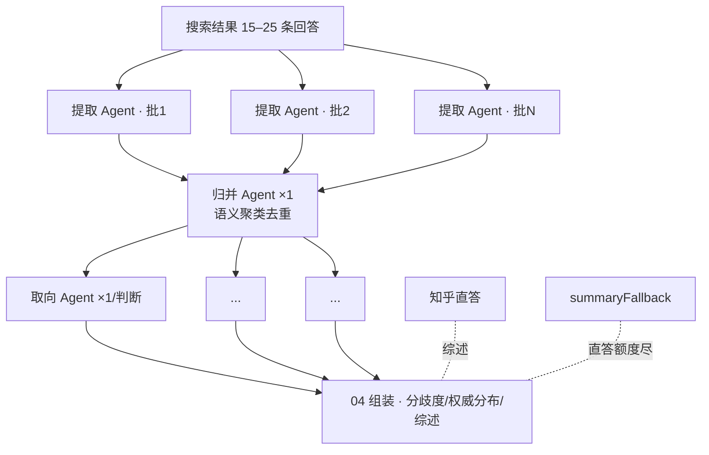
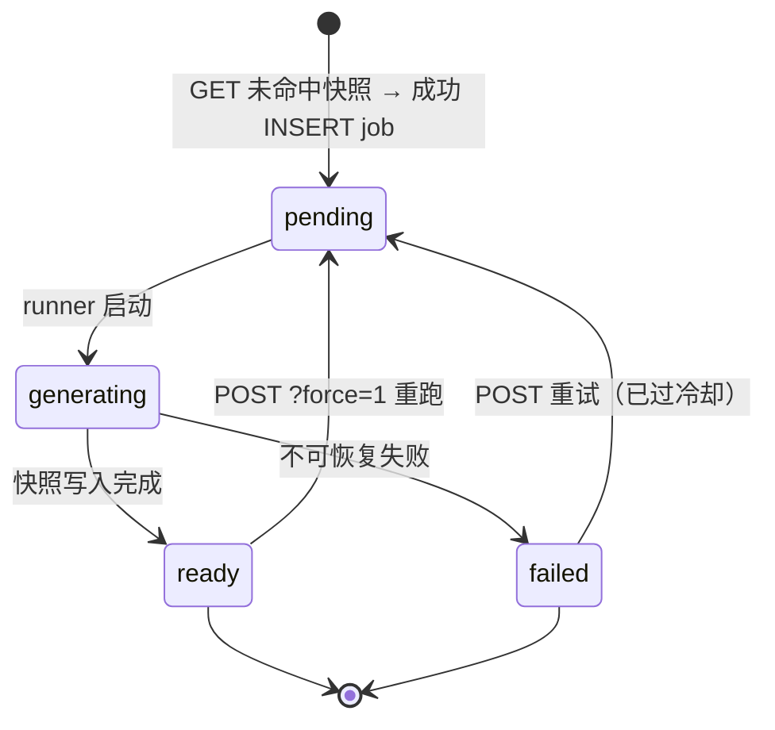

# 两面 · 后端开发文档

> 技术文档 3/3 · Bun + Hono (TypeScript) + SQLite · 自写轻量并发编排
> 总览见 [01-开发总览](./01-开发总览.md)，前端契约见 [02-前端开发文档](./02-前端开发文档.md)，密钥见 [04-环境变量与密钥清单](./04-环境变量与密钥清单.md)。
> 接口与凭证依据：知乎 Skill `0.5.3-beta.20260904115023`（2026-09-03/04 核验资料）。

---

## 1. 运行时与 Bun 兼容注意

- 运行时 **Bun**（`oven/bun` 镜像），框架 **Hono**，SQLite 用内建 `bun:sqlite`
- **LLM 调用不依赖任何重 SDK**：统一封装一个 OpenAI 兼容客户端（原生 `fetch` → `/v1/chat/completions`）。所有主流服务商（DeepSeek / GLM / Qwen / Kimi / OpenAI 等）都提供 OpenAI 兼容端点，配 `baseUrl` 即接入
- 回退路径：若某依赖在 Bun 下有兼容坑（如个别原生模块），`bun` 脚本头部允许直接 `node --run`（Node ≥22 跑 TS）执行——业务代码保持纯 TS + Web 标准 API，不锁死运行时
- Docker：`FROM oven/bun:1`，`bun install --frozen-lockfile && bun run src/index.ts`

## 2. 目录结构

```
apps/server/src/
├── index.ts          # Hono app 挂载 + 静态健康检查
├── routes/           # hot.ts / analysis.ts（主端点）/ auth.ts(条件)
├── pipeline/
│   ├── runner.ts     # 扇出/扇入编排器（信号量、超时、重试、状态上报）
│   ├── extract.ts    # 01 提取 Agent（批量 N 条回答/次）
│   ├── merge.ts      # 02 归并 Agent（串行）
│   ├── orient.ts     # 03 取向 Agent（每判断 1 个）
│   └── summarize.ts  # 04 综述（直答优先，降级外部 LLM）
├── llm/
│   ├── client.ts     # OpenAI 兼容 fetch 客户端（JSON mode + 重试 + 限速）
│   ├── registry.ts   # providers.yaml 加载与解析
│   └── zhida.ts      # 知乎直答客户端（独立鉴权与模型档位，不走 providers）
├── zhihu/            # 开放平台客户端（hot_list / zhihu_search / user/* / quota）
├── store/
│   ├── db.ts         # bun:sqlite 初始化 + 迁移
│   └── repo.ts       # analyses / jobs / hot_questions 读写
├── cron/
│   └── pregenerate.ts# 每日 00:30 Asia/Shanghai 全量预生成
└── lib/              # 时区、分歧度、去重、计数工具
```

## 3. LLM Provider 层（多服务商 · 每 Agent 绑定模型）

`config/providers.yaml` —— 服务商与模型解耦，Agent 按名引用：

```yaml
providers:
  - name: deepseek
    baseUrl: https://api.deepseek.com/v1
    apiKeyEnv: DEEPSEEK_API_KEY        # 密钥只从 env 读，不进 yaml
    models: [deepseek-chat, deepseek-reasoner]
  - name: glm
    baseUrl: https://open.bigmodel.cn/api/paas/v4
    apiKeyEnv: GLM_API_KEY
    models: [glm-4-flash, glm-4-plus]
  - name: qwen
    baseUrl: https://dashscope.aliyuncs.com/compatible-mode/v1
    apiKeyEnv: QWEN_API_KEY
    models: [qwen-plus, qwen-turbo]

# 每个 Agent 绑定一个 provider/model；可指定备选，主路径连续失败 3 次自动切换
agents:
  extract:   { provider: deepseek, model: deepseek-chat,    fallback: { provider: glm, model: glm-4-flash } }
  merge:     { provider: deepseek, model: deepseek-reasoner }
  orient:    { provider: deepseek, model: deepseek-chat,    fallback: { provider: qwen, model: qwen-plus } }
  summaryFallback: { provider: glm, model: glm-4-flash }   # 仅直答额度耗尽时用
```

**registry.ts** 职责：加载 yaml → 校验 env 存在 → 导出 `call(agent, messages, {jsonSchema})`。调用方永远写 Agent 名，不接触 provider 细节。**failover 只在 Agent 级**，不做跨供应商自动漂移，保持行为可预期。

**知乎直答不在这套配置里**：它用 Access Secret 鉴权、有自己的模型档位和字段约束（§8.2），单独封装在 `llm/zhida.ts`。

### 3.1 LLM 客户端约束

- 强制 JSON 输出：prompt 内嵌 schema + `response_format: {type: "json_object"}`（不支持的服务商降级为「解析失败即重试」）
- 超时 60s/次；指数退避重试 2 次（429/5xx 才重试，400 直接失败）
- 全局限速：令牌桶（默认 1000 req/min，`LLM_RPM_LIMIT` 可调），管线共享，防打爆
- 每次调用记录 `agent, provider, model, latency, tokens` 到 job detail，跑一次就能在进度页看到瓶颈

## 4. 多智能体管线（扇出—扇入）



### 4.1 阶段规格

| 阶段 | 并发 | 输入 | 输出 JSON | 失败处理 |
|---|---|---|---|---|
| 01 提取 | 批量化：一次喂 3–5 条回答，信号量 4 | 回答全文（含作者/认证/权威级） | `{judgments:[{text, quote, answerId}]}` | 单批失败丢弃该批并记日志，不阻塞其他批 |
| 02 归并 | 1 串行 | 全部判断句 + 引用 | `{judgments:[{id, text, sourceQuotes[]}]}` | 失败重试 2 次后整体失败，job 置 `failed`（`llm_error`） |
| 03 取向 | 每判断 1 个，信号量 6 | 单条判断 + 相关回答原文 | `{semanticAxis:{left,right}, scaleDirection:"left_to_right", slots:{1..5:[{answerId, reason}]}}` | **部分失败降级**：该判断保留 `orientStatus=partial`，不阻塞整体 |
| 04 综述 | 1 | 分布全貌 | 直答文本（或降级 LLM 文本） | 直答 30001/30002 → summaryFallback，响应标注 `summarySource` |

> **为什么单次只能拿 10 条**：`zhihu_search` 的 `Count` 服务端上限就是 10（`>10` 自动截断为 10，`<=0` 回退为 10）。这正是「多路 Query 去重合并」方案成立的前提——上限是**单次**的，不是总量上限。当前检索路数 = 原句 + LLM 扩写的 ≤3 个相似问法（`PIPELINE_QUERY_VARIANTS`，默认 4），去重后样本池上限 ≤40 条。

### 4.2 Prompt 硬约束（写死在 prompt 模板里）

提取：①只抽**可争议的判断句**，事实陈述一律不抽；②一条回答允许拆出多条彼此独立的判断，优先按对象、条件、时间范围、因果关系和价值取舍拆分，通常每条回答提取 2–6 条高信号判断；③每条判断必须绑定**至少一条原话引用**，抽不出即丢弃；④判断必须能在原文中定位；⑤少数派、限定条件、让步和反例要保留，不能被回答中的主立场覆盖。

归并：①只有核心主张、对象、条件和价值取舍都相同、仅措辞不同的判断才合并；②结论方向、适用对象/人群、前提条件、时间范围、因果解释不同，或同一回答中的主张与让步/反例不同，必须保留为不同判断；③代表表述要具体到可以单独被支持或反驳，最多输出 15 条时优先覆盖不同子议题和冲突关系，避免为了减少条数而过度合并；④同一 `answerId` 可以出现在多个判断中，表示一条回答确实包含多个观点；⑤若模型只返回 `sourceQuotes` 而漏填 `answerIds`，服务端会根据提取阶段的原话做保守反查补齐来源。

取向：①两端定义由判断内容**推导**，禁止预设正反方；②每个归位必须给出**绑定原话的理由**，无理由不采纳；③允许归入中间档（3 档），不强迫站边；④输出 `semanticAxis`（本条判断自己的语义轴）并固定 `scaleDirection: "left_to_right"`（slot 1 = 左端，slot 5 = 右端）。

> **slot 语义约束（模型层面的硬规则）**：每条判断定义一条自己的光谱，因此 **slot 只表示该判断内部的相对位置，不具备跨判断语义**。「判断 A 的 slot 1」与「判断 B 的 slot 1」之间不存在共同立场——禁止任何跨判断的 slot 聚合、平均或对比；分歧度与权威分布都只在**单条判断内部**计算。任何后续功能（如跨题对比）都必须基于 `semanticAxis` 重新对齐，而不是复用 slot 序号。

### 4.3 分歧度与信号分层

- **分歧度 = 纯熵**：五档计数的归一化香农熵 `H = -Σ pᵢ·ln pᵢ / ln 5`，映射 `low(<.35) / mid(<.55) / high(<.75) / extreme(≥.75)`。初始阈值，验证期可调。**不掺任何评论权重**——评论对分布的质疑走独立字段，不污染这个描述统计量
- **信号分层**（简报铁律）：回答是**唯一归因主体**；`CommentInfoList` 无评论者字段 → **不参与分布、不进分歧度**，只产出独立字段 `commentChallengeCount`，由前端单独展示「另有 N 条精选评论提出不同看法」。比起把评论塞进分数，「分布较集中 + 另有 4 条精选评论提出不同看法」两行独立呈现，更可解释也更诚实；专栏文章只入内容池标注单方论述，不参与分布
- **权威分布**：`authorityDistribution[slot] = count of L3–L4`，随分析一起输出，前端展示用

## 5. API 契约

前缀 `/api/v1`。所有响应包 `{code, data}`；错误 `{code, message}`。类型与 `packages/contract` 同步。

### 5.1 数据形状

```ts
interface Analysis {
  qid: string; question: string;
  date: string;               // "2026-09-08" (Asia/Shanghai)
  sampleCount: number;        // 实际 N 条回答（条数，不是人数）
  judgments: Judgment[];      // 10–15 条
}
interface Judgment {
  id: string; text: string;
  participantCount: number;       // 参与该判断分布的答主数（人数，去重到人）。不用 stance，避免把语义拉回「站队」
  divergence: "low"|"mid"|"high"|"extreme";  // 纯熵，见 §4.3
  commentChallengeCount?: number; // 独立字段：另有 N 条精选评论提出不同看法（不进分歧度、不计入 participantCount）
  orientStatus: "done"|"partial";
  semanticAxis: { left: string; right: string }; // 本条判断自己的语义轴（Agent 推导，不预设正反）
  scaleDirection: "left_to_right";               // slot 1 = left 端，slot 5 = right 端
  distribution: Array<{       // 仅出现有人答主的档；slot 仅在本判断内部有相对语义，跨判断不可比较（§4 约束）
    slot: 1|2|3|4|5;
    authors: AuthorRef[];
  }>;
  authorityDistribution: number[]; // 长度 5，仅本判断内部统计
  summary?: string; summarySource?: "zhida"|"fallback"; // 来源标识必须保留，前端据此双态展示
}
interface AuthorRef {
  name: string; badge?: string;     // AuthorBadgeText（认证文案）
  authority: 1|2|3|4;               // AuthorityLevel —— 源接口返回 String，入库时转 number
  quote: string;                    // 原话
  url: string;                      // 知乎原文链接（接口已带溯源 UTM，原样透传）
  reason: string;                   // 归位理由（可回溯）
  voteUp: number;
}
```

### 5.2 计数口径（锁死，前后端必须一致）

| 字段 | 统计对象 | 口径 |
|---|---|---|
| `sampleCount`（分析级） | 回答**条数** | ≤4 路 Query（原句 + LLM 扩写问法）去重合并后实际纳入内容池的回答数；专栏文章不计入；UI 用于头部声明「基于 N 条回答」 |
| `participantCount`（判断级） | 答主**人数** | 被归入该判断光谱分布、且有明确 slot 归位的答主，去重到人 |
| `authorityDistribution[slot]` | 答主**人数** | 同一判断内 L3–L4 答主，去重到人 |
| `commentChallengeCount` | 评论**条数** | 该判断相关回答下「提出不同看法」的精选评论条数（评论无作者字段，故按条计） |

`participantCount` 硬规则（可直接写成单测断言）：

1. 同一答主在同一判断上即使有多条回答被归入，也只计 1 次
2. 只统计**有明确 slot 归位**的答主；`orientStatus:"partial"` 中未归位者不计入
3. 空档贡献 0，且不画点
4. `Σ distribution[].authors.length === participantCount`
5. `Σ authorityDistribution ≤ participantCount`（只含 L3–L4）
6. `participantCount === 0` 的判断直接丢弃，不出现在 `judgments` 里
7. `participantCount === 1` → `divergence` 固定为 `low`（熵恒为 0）
8. `commentChallengeCount` 不计入 `participantCount`、不影响 `divergence`
9. UI 文案：钉子「N 人表态」= `participantCount`；头部声明「基于 N 条回答」= `sampleCount`。**两者维度不同，禁止互换或混用**

### 5.3 端点（一个主端点）

| 方法/路径 | 行为 |
|---|---|
| `GET /questions/:qid/analysis` | **唯一主端点**。ready → `200` + 完整 Analysis；未完成/失败 → `202` + `ProgressResp`；qid 非法或非 question → `404` |
| `POST /questions/:qid/analysis` | **仅用于失败重试 / 强制重跑**（`?force=1`）。幂等：非 `failed` 态直接返回当前态；`failed` 且已过冷却 → 清旧 job 重新竞争（见 §6） |
| `GET /hot` | 当日热榜 `{date, items:[{qid,title}]}`，**只含已 ready 的预置题**（30 条，前端裁 24）；当日无数据 → 404 |
| `GET /me/related?qid=` | 增强层 · 当日热榜题里「与你有关」的那些 `{authorized, degraded?, items:[{qid,reasons[]}]}`。未登录 → **200** + `authorized:false`（有意不用 403，见 §6.4）；`qid` 可选，用于带外直接打开的问题页 |
| `GET /auth/zhihu/authorize` | 条件模块 · 302 到 `https://openapi.zhihu.com/authorize?redirect_uri=&app_id=&response_type=code`，可带 `state` |
| `GET /auth/zhihu/callback`（及公网 `/callback` 别名） | 条件模块 · 读取回调参数 **`authorization_code`**（兼容 `code`）→ 后端换 token；**不留存、只取公开范围数据**，会话 cookie |
| `GET /me/opposite?judgmentId=` | 条件模块 · 「光谱另一侧」推荐：`{author: AuthorRef, mySlot, theirSlot}`；未授权 403 |
| `GET /health` | `{ok:true, date, quota:{zhihu_search, hot_list, zhida_openai}}`，额度来自知乎 `/api/v1/quota`（查询本身不消耗额度） |

**独立的 `GET /progress` 已取消**：进度就是 202 的响应体，前端只轮询一个 URL，状态机从三端点降到一端点。

```ts
interface ProgressResp {
  status: "pending" | "generating" | "failed";
  stage: "extract" | "merge" | "orient" | "render";  // failed 时为失败发生阶段
  stageRatio: number;        // 0..1
  sampleCount: number;       // 已获取回答数
  judgmentsDone: number; judgmentsTotal: number;
  error?: { code: ErrorCode; message: string; retryable: boolean };
}
type ErrorCode = "zhihu_error" | "quota_exhausted" | "llm_error" | "timeout" | "parse_error";
```

**GET 的副作用边界（全系统唯一一处读请求带副作用）**：快照未命中时，GET 会隐式触发按需生成——先参与 job 的 `INSERT` 竞争（§6.3），抢到所有权则启动 runner，随后返回 202。理由：带外直接打开某个 qid 时，前端不必先 POST 才拿得到进度。幂等性由 `UNIQUE(date, qid)` 保证，重复 GET 不会重复生成；`ready` 之后退化为纯读。

> ⚠️ **正常产品路径不触达这条分支**（2026-09-13 收敛）：产品入口只有热榜，所有可见题目都在 00:30 预生成完毕。按需生成只在「热榜已抓取但尚未跑完」「带外/运维直接访问某个 qid」时出现。且它**不做任何 qid 反查**——题名不在 `question_titles` 缓存且未带 `?title=` 时直接 `failed`（不碰网络）。

## 6. 任务状态与失败闭环

生成任务模型：**每 `{date, qid}` 一个 job**，阶段进度写 `jobs` 表（内存为主、SQLite 落底），主端点直读。

### 6.1 状态定义与转换



| 状态 | 含义 | 终态 |
|---|---|---|
| `pending` | job 已 INSERT，runner 未启动/排队中 | 否 |
| `generating` | 管线运行中，`stage` 实时更新 | 否 |
| `ready` | 快照写入完成 | **是** |
| `failed` | 管线异常终止，记录 `error_code` | **是（可显式重试）** |

转换规则：

- 无行 → GET 隐式触发：`INSERT OR IGNORE` jobs + analyses(`pending`)
- `pending → generating`：获得所有权的进程启动 runner
- `generating → ready`：写 `data`，job 行标记完成
- `generating → failed`：归并失败 / 全部提取失败 / 直答与回退都失败 / 超时
- `failed → pending`：**仅由 POST 触发**，且需过冷却（默认 60s，`ANALYSIS_RETRY_COOLDOWN_SEC`）
- `ready → pending`：仅 `POST ?force=1`（重跑并覆盖旧快照）
- **`failed` 不自动重试**，避免额度黑洞；次日 cron 用新日期键自然重建

### 6.2 失败分类与可重试性

| `error_code` | 触发条件 | 知乎侧 `Code` | retryable | 前端文案 |
|---|---|---|---|---|
| `zhihu_error` | 开放平台 5xx / 网络失败 / 鉴权失败 | `20001`、`30001`、`90001` | 30001 ✅ / 20001 ❌ | 知乎接口暂时不可用 |
| `quota_exhausted` | 知乎日额度耗尽 | `30002` | ❌ | 今日额度已用尽，明天再来 |
| `llm_error` | 主模型与备选模型均失败 | — | ✅ | 分析服务暂时不可用 |
| `timeout` | 单 job 超过总时限（默认 600s） | — | ✅ | 生成超时，可重试 |
| `parse_error` | 结构化输出连续解析失败 | `10001` | ✅ | 结果解析异常，可重试 |

前端契约：202 且 `status:"failed"` → **停止轮询**，渲染失败卡片（文案按 `error_code` 取），`retryable:true` 时给「重试」按钮 → 调 POST → 回到轮询。`quota_exhausted` 与鉴权失败不给重试按钮。

### 6.3 并发、取消与恢复

- **并发归属：谁成功 INSERT，谁才拥有启动 runner 的权利。** 插入成功 → 本进程启动 runner；`UNIQUE` 冲突 → 已有 worker 持有，直接读其进度返回，**绝不启动第二个 runner**。唯一约束即锁，不引入额外互斥。POST 重试同理：先删旧 job 行，再参与同一套竞争
- **取消不是后端状态**：前端「取消」只是停止轮询，后端任务继续跑完并写入快照，下次进来就是 ready
- **重启恢复是 job 级，不是 Agent checkpoint 级**：启动时扫描当日 `status IN ('pending','generating')` 的行整跑重入队；`failed` 不入队（等显式重试或次日）
- **判断级部分失败不算 failed**：单条判断归位失败保留 `orientStatus:"partial"`，整体仍置 `ready`
- **重试冷却**：`attempts` 累加并刷新 `updated_at`；同 qid 冷却期内重复 POST 直接返回当前态，不触发新 job

## 7. 存储与按日分析快照（SQLite）

```sql
CREATE TABLE hot_questions (
  date TEXT NOT NULL, qid TEXT NOT NULL, title TEXT NOT NULL, url TEXT NOT NULL,
  fetched_at TEXT NOT NULL, PRIMARY KEY (date, qid));

CREATE TABLE analyses (
  date TEXT NOT NULL, qid TEXT NOT NULL,
  status TEXT NOT NULL CHECK (status IN ('pending','generating','ready','failed')),
  data TEXT,                -- ready 时为该题当日完整分析快照（Analysis JSON）
  error_code TEXT,          -- failed 时：zhihu_error|quota_exhausted|llm_error|timeout|parse_error
  error_message TEXT,
  attempts INTEGER NOT NULL DEFAULT 0,  -- 触发次数（含重试），用于冷却判断
  updated_at TEXT NOT NULL, PRIMARY KEY (date, qid));

CREATE TABLE jobs (
  id TEXT PRIMARY KEY, date TEXT NOT NULL, qid TEXT NOT NULL,
  stage TEXT NOT NULL, detail TEXT,          -- 各 Agent 调用统计
  started_at TEXT NOT NULL, updated_at TEXT NOT NULL,
  UNIQUE (date, qid));
```

- **快照键 `{Asia/Shanghai 日期}:{qid}` 即主键**——`analyses` 的一行就是一道题当天的完整分析快照，前端读的就是它；快照当日有效，过期 = 查询日 ≠ 当日（显式时区计算，代码内 `Intl.DateTimeFormat('sv-SE', {timeZone:'Asia/Shanghai'})` 取日期，不依赖进程时区）
- 读路径只查当日行；历史行保留供回溯，每日启动时清理 7 天前数据
- WAL 模式开启；单文件挂载 compose volume
- **按日快照同时满足赛事要求**：官方明确要求「调用有额度限制的开放能力时应在应用层缓存与请求去重」，我们的按日快照 + 题内去重正是这条要求的实现

## 8. 知乎开放平台接入

### 8.1 鉴权（所有接口统一）

```http
Authorization: Bearer <ZHIHU_ACCESS_SECRET>
X-Request-Timestamp: <秒级 Unix 时间戳>
Content-Type: application/json
```

- 鉴权凭证是 **Access Secret**（开放平台个人中心申请），**不是** OAuth 的 App ID / App Key——两者完全不同，详见 [04-环境变量与密钥清单](./04-环境变量与密钥清单.md)
- 服务端同时校验 `Authorization` 与时间戳；时间戳必须是**秒级** Unix
- 代表已授权用户访问用户数据时，在同样两个头之外追加 `X-OAuth-Token: <用户 OAuth access token>`
- 基础域名 `https://developer.zhihu.com`（直答同域），Access Secret 不发送到其他主机

### 8.2 接口清单

| 用途 | 方法 | 路径 | 关键参数与上限 |
|---|---|---|---|
| 知乎热榜 | GET | `/api/v1/content/hot_list` | `Limit` 默认 30、最大 30（超限回退 30）；返回问题与文章两类，按 `Url` 过滤只留 question |
| 知乎搜索 | GET | `/api/v1/content/zhihu_search` | `Query` 必填且非空；`Count` 最大 10（`>10` 截断为 10） |
| 问题回答 | GET | `/api/v1/content/question_answers` | `QuestionUrl` 必填（完整问题 URL，裸 qid 报 `10001`）；`Offset` 分页，`Limit` 1–50 默认 20。**本项目刻意不使用**——条目只有 `ContentType/ContentToken/Url/Summary`，无作者/认证/权威级/赞同数，且 `Summary` 是 ≤211 字的服务端摘要而非全文；「每档站着真实答主」是硬约束，故继续走 `zhihu_search` |
| 知乎直答 | POST | `/v1/chat/completions` | 仅 `model` / `messages` / `stream` 三字段受支持；`model` ∈ `zhida-fast-1p5`、`zhida-thinking-1p5`、`zhida-agent`；`stream` 默认 false |
| 额度查询 | GET | `/api/v1/quota` | `APIIDs` 逗号分隔，省略返回全部 7 项；**不消耗业务额度** |
| 用户创作 | GET | `/api/v1/user/contents` | `ContentType` 必填；`Limit` ≤ 50 |
| 用户关注 | GET | `/api/v1/user/followees` | `Limit` ≤ 50 |
| 收藏夹列表 | GET | `/api/v1/user/favlists` | `Limit` ≤ 50 |
| 收藏夹内容 | GET | `/api/v1/user/favlist_contents` | `FavlistUrlToken` 必填 |
| 近期收藏 | GET | `/api/v1/user/collections` | 无 Offset / Paging，只返回近期一批 |

**直答的两条硬约束**（印证简报判断）：①`response_format` 不在支持字段内，结构化输出不可用；②其他字段「不作为正式支持能力，不保证生效」。所以综述用非流式、纯文本取回，靠 prompt 约束输出形态，不依赖结构化输出。默认档位 `zhida-thinking-1p5`（`ZHIHU_ZHIDA_MODEL` 可切）。

### 8.3 字段与类型注意（踩坑点）

- `AuthorityLevel` 返回 **String**（`"1"`–`"4"`），契约里是 number，**入库前必须转换**
- `AuthorBadge` 是认证标图片 URL，`AuthorBadgeText` 才是认证文案——我们只用后者
- `Url` 自带溯源 UTM（`utm_medium=openapi_platform&utm_source=...`），**原样透传给前端跳转，不改写、不去参**
- `ContentText` 是内容文本；`CommentInfoList[].Content` 只有评论正文、无作者字段（这正是「评论不进分布」的技术原因）
- 内容 GET 接口**可能在 HTTP 200 里返回业务错误**（`Code != 0`）：必须判 `Code`，不能把 `20001` 当成空结果
- 用户数据分页：`Paging.IsEnd=false` 时把 `NextOffset` 原样作为下次 `Offset`；`NextOffset` 是 String，需严格解析为 Int64
- ⚠️ **但 `favlist_contents` 的分页元数据实测不可信**（2026-09-13 三轮探测）：同一个 33001 条的收藏夹，`Offset=0&Limit=20` 返回 `{IsEnd:false, NextOffset:"20", Totals:33001}`，`Offset=20` 却返回 `{IsEnd:true, Totals:39}`，`Offset=50` 又回到 `{IsEnd:false, Totals:33001}` —— `IsEnd` 与 `Totals` 自相矛盾。**本项目不采信服务端分页字段**，改为自算 `Offset = page × Limit`，并以「返回条数 < Limit」判定到底（见 `zhihu/user.ts` 与 `user-signals.ts`）
- 收藏夹内容**按新→旧排序**（`Offset=0` 与 `Offset=50` 的首条 id 单调递减），所以「最近收藏」只需读浅层几页
- 条目数可能略少于 `Limit`（有被过滤项）：`Limit=50` 实测返回 49
- 用户数据接口必须同时带 `Authorization: Bearer <Access Secret>` 与 `X-OAuth-Token: <用户 token>`；**token 只在请求头出现，永不写日志/响应/数据库**

### 8.4 错误码 → 我们的 `error_code`

| 知乎 `Code` | 含义 | 映射 | 处理 |
|---|---|---|---|
| `0` | 成功 | — | — |
| `10001` | 参数错误 | `parse_error` | 是我们的请求构造问题，不盲目重试 |
| `20001` | 鉴权失败 | `zhihu_error` | **不可重试**，告警查凭证 |
| `30001` | 频率限制 | `zhihu_error` | 退避后重试 |
| `30002` | 配额耗尽 | `quota_exhausted` | **不可重试**，次日恢复 |
| `90001` | 内部错误 | `zhihu_error` | 有限重试 |

### 8.5 额度（每日自然日，账号下所有 Secret 共享同一额度池）

| 能力 | APIID | 日额度 | 我们日消耗 |
|---|---|---:|---|
| 知乎搜索 | `zhihu_search` | 5,000 | ≤120（30 题 × ≤4 路：原句 + 扩写问法） |
| 知乎热榜 | `hot_list` | 100 | 1 |
| 问题回答 | `question_answers` | 100 | 0（刻意不用，见 §8.2） |
| 知乎直答 | `zhida_openai` | 5,000 | 0（综述改由刘看山人格 + 外部 LLM 承载） |
| 用户数据 | `user_data` | 10,000 | 增强层「与你有关」：单会话 1+夹数×页数（默认 1+5=6 次），TTL 600s 内不重复 |
| 全网搜索 | `global_search` | 5,000 | 0（不用：会丢知乎专属信号） |
| 知识库 | `knowledge` | 500 | 0 |
| 小工具 | `tools` | 10 | 0 |

额度耗尽后该账号下所有 Access Secret 都无法调用该能力。提额邮件 <openplatform@zhihu.com>（工作日 1 个工作日内回复）。

### 8.6 OAuth（增强层，条件模块）

完整流程（黑客松专用；授权端点、Token 交换参数与用户数据鉴权组合与普通项目一致，以本文档为准）：

1. **跳转授权**
   `GET https://openapi.zhihu.com/authorize?redirect_uri={uri}&app_id={app_id}&response_type=code`，可带随机 `state` 关联会话。最终确认必须用户本人完成。
2. **接收回调**
   实测主回调参数是 **`authorization_code`**（兼容读 `code`）。没有授权码就停止流程，不继续换 token。
3. **换取 token**
   `POST https://openapi.zhihu.com/access_token`，`Content-Type: application/x-www-form-urlencoded`，表单字段：
   `app_id` / `app_key` / `grant_type=authorization_code` / `redirect_uri` / `code`（字段名是 `code`，值取回调里的 `authorization_code`）。
   成功判定看响应里**有没有 `access_token`**，并读 `expires_in`；不要只凭 `code: 20000` 判断。
4. **调用用户数据**：`Authorization: Bearer <Access Secret>` + `X-OAuth-Token: <access_token>` + 时间戳。
5. `redirect_uri` 必须与活动页面登记值**完全一致**（协议、域名、路径、尾部斜杠）。
6. Token 过期或鉴权失败 → 停止读取用户数据，**不回退到 Access Secret 所属账号**。

**会话形态**：Access token 只存在本进程内存（`Map<sessionId, {accessToken, expiresAt}>`），浏览器只拿到 HttpOnly 的随机 session id。token 与授权码**永不写日志、永不进响应、永不落库**。会话过期或退出登录时，连同用户信号缓存一并释放。

### 8.7 「与你有关」标记（增强层，条件模块）

**要解决的问题**：热榜上哪几道题和当前用户有关系，值得先点。

**关键约束（2026-09-13 实测结论）**：开放平台**没有「关注了哪些问题」的接口**。`user_followees` 是「关注的**用户**」，`user_collections` 对该账号实测返回 0 条。也没有回答详情类接口可以按 answer id 反查作者。因此本功能只承认**两种 id 级精确匹配**：

| reason | 依据 | 精度 |
|---|---|---|
| `question_favorited` | 收藏夹里 `ContentType=question` 的条目 → `Url` 含 `/question/<qid>` | qid 精确 |
| `answer_favorited` | 收藏夹里回答条目的 `/answer/<id>`，与快照 `judgments[].distribution[].authors[].url` 里的回答 id 求交 | id 精确 |

**刻意不做**：按昵称匹配「你关注的人是不是这题的答主」。`user_followees` 给的是 `Fullname` / `UrlToken`，而我们的 `AuthorRef` 只有昵称，只能靠昵称相等判断 —— 重名即误判，且标记文案会变成对「同一个人」的断言。宁缺毋滥。

**行为契约**：

- 未登录 → `200` + `{authorized:false, items:[]}`。**有意偏离 `/me/opposite` 的 403 语义**：前端必须能区分「没登录」（正常，安静降级）与「出错了」（要提示/重试），403 会把两者混成一个分支。
- 取收藏失败（接口/额度/风控）→ `200` + `{authorized:true, degraded:true, items:[]}`，并在日志留 `userSignals.degraded`。**绝不抛错**：这是增强层，不能拖挂主流程。
- **只漏报，不误报**：一条回答若在归类阶段被判为「不涉及任何议题」，它不进快照，收藏它也就点不亮标记。缺省不渲染标记 —— 「没标记」不等于「与你有关」的反面。
- 扫描范围：`ZHIHU_FAV_SCAN_LISTS`(5) 个收藏夹 × `ZHIHU_FAV_SCAN_PAGES`(1) 页 × `ZHIHU_FAV_PAGE_SIZE`(50) 条。收藏夹是新→旧排序，当日热榜都是新鲜题，浅层几页足够。单会话约 6 次 `user_data` 调用，`USER_SIGNAL_TTL_SEC`(600s) 内不重复扫。
- 快照回答索引按日缓存（`answerIndexFor`），只在当日 ready 题数变化时重建，避免每个请求重解 30 份 JSON。
- 观测：`userSignals.scanned` / `userSignals.degraded` / `userSignals.indexBuilt` / `me.related.served`（含 `items` 与 `reasons`，**不含任何 token**）。

## 9. 定时预生成

- 启动时后台检查当天 `hot_questions`：没有候选时抓取热榜并入库，有候选时从本地列表补齐尚未完成的分析；已 ready 的题复用，生成结果写入本地 SQLite（容器内 `/app/data/two-sides.db`，挂载持久卷）。不等待整批完成就提供 HTTP 服务。
- `cron` 模块内置进程（Bun 定时器计算下一个 `Asia/Shanghai 00:30`），与启动补生成共用当日批次；只有一个热榜请求在运行，当天已抓取的列表不重复抓取。`ZHIHU_LIVE` 关闭、凭证缺失或 `PREGENERATE_TOP=0` 时跳过自动预生成。
- 流程：读取或抓取热榜 → 过滤 question → 按 `PREGENERATE_CONCURRENCY` 并发跑管线 → 成功写 ready；单题失败标记 `failed` 并继续，不阻塞队列（失败题不进 hot 列表，其余题目照常）。
- **单题预算 600s（2026-09-13 放宽）**：产品入口只剩热榜、没有用户在等，00:30 这一批可以做得更充分——单题检索 ≤4 路问法（原句 + LLM 扩写），样本池从 ≤10 条提到 ≤40 条，主题发现一次吃下整池。按 30 题 × 4 worker 估算，整批远早于用户活跃时段完成。
- 自动预生成跳过 ready 和 failed，failed 等用户显式重试或次日重建。重启发现旧进程的未过期任务锁时，到期后仅复查一次，仍走既有任务竞争规则，不抢占活跃 worker。抓取异常记录日志，保持 HTTP 与每日 cron 正常运行。
- 按需生成（带外 qid）兜底保证用户侧永不白屏
- 全程日志结构化（阶段、耗时、token 消耗），方便评审期排查

## 10. 部署（docker-compose）

```yaml
services:
  web:        # Caddy：静态 Vue 产物 + 反代 /api → server
    image: ghcr.io/bingxin666/two-sides-web:master
    ports: ["127.0.0.1:8080:8080"]   # 只绑本机回环；对外反代与 TLS 由你自行部署，不在本项目范围
    # 静态产物与 Caddyfile 已内置在镜像中
  server:
    image: ghcr.io/bingxin666/two-sides-server:master
    environment:
      - TZ=Asia/Shanghai
      - ZHIHU_ACCESS_SECRET
      - ZHIHU_OAUTH_APP_ID / ZHIHU_OAUTH_APP_KEY / ZHIHU_OAUTH_REDIRECT_URI   # 增强层
      - DEEPSEEK_API_KEY / GLM_API_KEY / QWEN_API_KEY
    volumes: ["server-data:/app/data"]   # SQLite 单文件
    restart: unless-stopped
```

- Caddyfile 核心：站点块 `:8080`、`root * /srv` + `file_server`；`handle /api/* → reverse_proxy server:3000`
- **TLS / 对外反代不归 compose 管**：你自行部署反代，指向 `127.0.0.1:8080` 终止 HTTPS 即可；Caddy 不签证书、不占 443
- 秒开验收标准：热榜页与热榜题 **TTFB < 200ms、渲染路径无任何实时生成调用**（按需生成路径除外）

## 11. 安全与合规红线

1. 数据全部来自官方开放平台，不爬取、不绕过反爬
2. **三种凭证不混用**：Access Secret 鉴权调用方，App ID / App Key 用于 OAuth，用户 token 代表授权用户。App Key 不能当 Access Secret 用，反之亦然
3. OAuth 用户数据**不留存**、不超出公开范围、不用于推荐以外目的；callback 换 token 后仅内存会话
4. 每个归位可回溯（reason + 原话），产品不评判对错
5. 密钥仅 env 注入；日志不打印凭证、`Authorization` 头、用户 query 与完整响应
6. 诊断信息只展示：凭证来源、是否配置、长度、SHA-256 短前缀
7. 限速自护：对外部 LLM 令牌桶，对知乎接口按额度表节流；失败重试一律过冷却，防止重试风暴把额度打穿
8. **提交前必查**：App Key、Access Secret、OAuth Token 没有出现在代码仓库、前端响应、日志、截图或演示视频中
